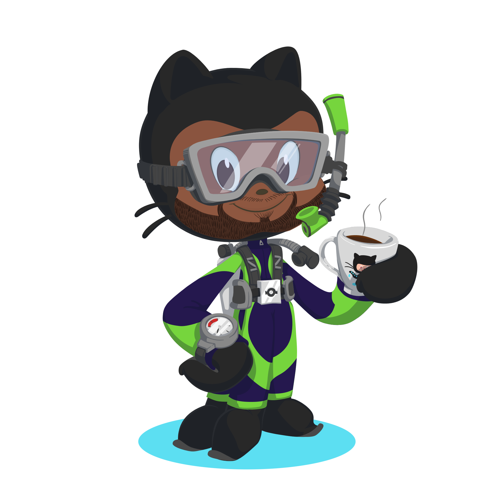

# 💫 About Me:
Hi 👋🏽, my name's David. I'm a husband, father and platform engineer

### My hobbies: 
* Home DIY (but by no means restricted to my home solely), that includes electrics, plumbing and carpentr - all three of which involve problem solving
* As I've just mentioned, problem solving (I love riddles) and also strategy games (always up for a game of chess or an escape game)

### My interests (in no particular order):
* Formula 1
* Football - playing and watching
* Playing golf
* Playing the piano
* Scuba diving (PADI certified ✅)

## 💻 Technological Interests
I'm interested in a number of programming languages and tech stacks but at present what interests me most is:

     

