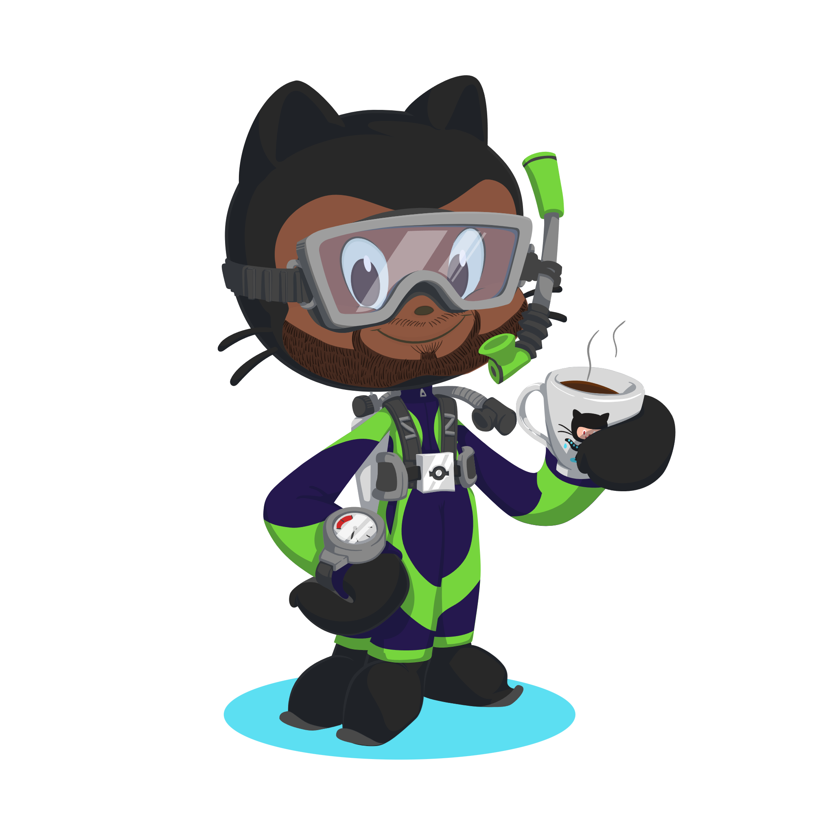

## 👋🏽 About me:
Husband, father, platform engineer

### ⚒️ Hobbies: 
* Home DIY (but by no means restricted to my home solely), including electrics, plumbing and carpentry
* Problem solving and strategy games (always up for a game of chess or an escape game)

### 🤩 Interests:
* Running
* Formula 1
* Football
* Playing golf
* Scuba diving (PADI certified ✅)
* Piano

## 💻 Technological Interests
I'm interested in different programming languages and tech stacks but at present what interests me most is:

     

